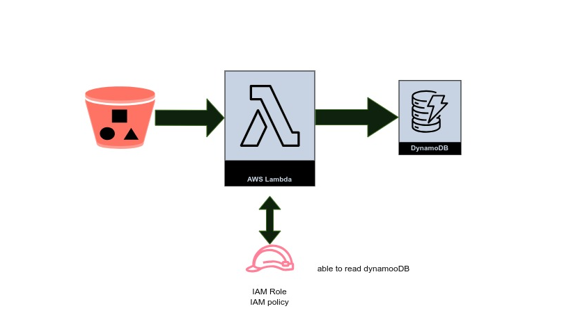

 # S3 Data Processing and Analysis with AWS Lambda and DynamoDB

 

***Key features of the project include:***

- Setting up an S3 bucket and configuring event notifications
- Creating a Lambda function using AWS SDK or programming language of choice
- Implementing the Lambda function to process data from S3 events
- Storing relevant information in a DynamoDB table

**Prerequisites**

Before you begin, make sure you have the following:

- An AWS account
- AWS CLI installed and configured with your account credentials
- Basic knowledge of AWS Lambda, S3, and DynamoDB

**Step 1: Create a DynamoDB Table**

1. Open the AWS Management Console and navigate to the DynamoDB service.
2. Click on "Create table" and provide a table name, primary key, and any additional configuration options you require.
3. Click on "Create" to create the table.

**Step 2: Create an S3 Bucket**

1. Open the AWS Management Console and navigate to the S3 service.
2. Click on "Create bucket" and provide a unique bucket name and any additional configuration options you require.
3. Click on "Create" to create the bucket.

**Step 3: Create an IAM Role for Lambda**

1. Open the AWS Management Console and navigate to the IAM service.
2. Click on "Roles" and then "Create role".
3. Select the "Lambda" service as the trusted entity.
4. Attach the necessary policies to the role, such as "AmazonS3FullAccess" and "AmazonDynamoDBFullAccess".
5. Click on "Next" and provide a name for the role.
6. Click on "Create role" to create the IAM role.

**Step 4: Create the Lambda Function**

1. Open the AWS Management Console and navigate to the Lambda service.
2. Click on "Create function" and select the "Author from scratch" option.
3. Provide a name for the function, select the runtime as per your preference (e.g., Node.js, Python, etc.), and choose the IAM role created in Step 3.
4. Click on "Create function" to create the Lambda function.
5. In the function code section, implement the logic to handle the S3 event and store the information in DynamoDB. You can use the AWS SDK for your chosen runtime to interact with DynamoDB.
6. Configure the trigger by clicking on "Add trigger" and selecting the S3 bucket created in Step 2. Specify the event type (e.g., "ObjectCreated") and any other relevant configuration options.
7. Click on "Save" to save the Lambda function.

**Step 5: Test the Setup**

1. Upload an object to the S3 bucket you created in Step 2.
2. Monitor the execution logs of the Lambda function to ensure it is triggered and successfully stores the object information in DynamoDB.

Congratulations! You have successfully set up a Lambda function to trigger on S3 uploads and store information in DynamoDB. You can now customize and extend this setup based on your specific requirements.

Please note that this is a high-level overview, and you may need to refer to the [AWS documentation](https://aws.amazon.com/documentation/) for detailed information on specific steps and configurations.

Happy coding!